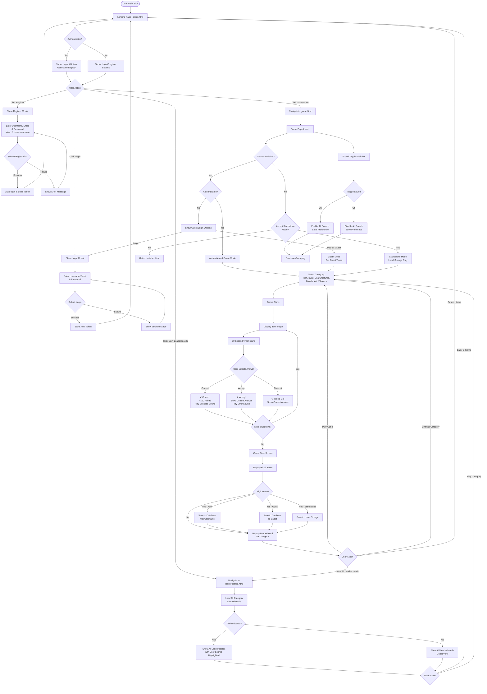

# Animal Crossing Quiz Game - User Flow Diagram

## Overview
This document outlines the complete user journey through the Animal Crossing quiz game application, including all decision points, authentication flows, and gameplay paths.

---

## Visual Flow Diagram (Mermaid)



---

## Detailed User Flows

### 1. First-Time Visitor Flow

**Entry Point:** Landing page (index.html)

1. User arrives at the site
2. Sees welcome screen with game title
3. Options presented:
   - **Start Game** button (prominent)
   - **Login** button
   - **Register** button
   - **View Leaderboards** link

**Decision Point:** Play as guest or create account?

- **Guest Path:** Click "Start Game" → Redirected to game.html → Prompted to play as guest or login
- **Register Path:** Click "Register" → Modal opens → Enter details → Auto-login → Return to landing page

---

### 2. Registration Flow

**Entry Point:** Click "Register" button

1. Registration modal appears
2. User enters:
   - Username (max 10 characters)
   - Email address
   - Password
3. Client-side validation:
   - Username length check
   - Email format validation
   - Password strength check
4. Submit registration
5. **Server Response:**
   - **Success:** Auto-login, store JWT token, close modal, update UI
   - **Failure:** Display error (username taken, email exists, etc.)
6. User can now play with saved scores

---

### 3. Login Flow

**Entry Point:** Click "Login" button

1. Login modal appears
2. User enters:
   - Username or Email
   - Password
3. Submit login
4. **Server Response:**
   - **Success:** Store JWT token, close modal, update UI with username
   - **Failure:** Display error message
5. User redirected to previous page or landing page

**Alternative Entry:** From game page when attempting to save score

---

### 4. Game Play Flow (Authenticated User)

**Entry Point:** Click "Start Game" from landing page

1. Navigate to game.html
2. System checks authentication status
3. **Authenticated:** Display username in UI
4. Select game category:
   - Fish
   - Bugs
   - Sea Creatures
   - Fossils
   - Art
   - Villagers
5. Game starts:
   - Item image loads from Nookipedia API
   - 30-second timer begins
   - 4 multiple choice answers displayed
6. **User answers:**
   - **Correct:** Green feedback, +100 points, success sound
   - **Wrong:** Red feedback, show correct answer, error sound
   - **Timeout:** Yellow feedback, show correct answer
7. Next question loads (repeat for 10 questions)
8. Game over screen shows final score
9. **High score check:**
   - If high score: Save to database with username
   - Display leaderboard for category
10. **Options:**
    - Play again (same category)
    - Change category
    - View all leaderboards
    - Return home

---

### 5. Game Play Flow (Guest User)

**Entry Point:** Click "Start Game" without authentication

1. Navigate to game.html
2. System detects no authentication
3. **Prompt appears:** "Play as Guest" or "Login"
4. **Guest chooses "Play as Guest":**
   - Guest token generated and stored
   - Same gameplay as authenticated user
5. Game proceeds identically to authenticated flow
6. **High score save:**
   - Saved to database as "Guest" entry
   - No username association
7. **Limitation:** Cannot view personal score history

---

### 6. Standalone Mode Flow

**Entry Point:** Server unavailable during game load

1. User navigates to game.html
2. System attempts server connection
3. **Connection fails**
4. **Prompt appears:** "Server unavailable. Play in standalone mode? (Scores saved locally only)"
5. **User accepts:**
   - Game loads with local data
   - Scores saved to browser localStorage
   - Leaderboards show only local scores
6. **User declines:**
   - Redirected to landing page
   - Error message displayed

**Note:** Standalone mode confirmation persists for browser session to avoid repeated prompts

---

### 7. Leaderboard Viewing Flow

**Entry Point:** Click "View Leaderboards" or post-game leaderboard display

1. Navigate to leaderboards.html
2. System loads leaderboards for all categories:
   - Fish
   - Bugs
   - Sea Creatures
   - Fossils
   - Art
   - Villagers
3. **Display format:**
   - Top 10 scores per category
   - Rank, username, score, date
4. **If authenticated:**
   - User's scores highlighted in gold
   - Personal best shown
5. **If guest:**
   - View-only mode
   - Guest entries visible
6. **Navigation options:**
   - Back to game
   - Play specific category (click category name)
   - Return home

---

### 8. Sound Control Flow

**Entry Point:** Sound toggle button (desktop) or mobile sound icon

1. User clicks sound toggle
2. **Current state checked:**
   - **On → Off:** Mute all sounds, update icon, save preference
   - **Off → On:** Enable all sounds, update icon, save preference
3. Preference saved to localStorage
4. Sounds affected:
   - Background music
   - Correct answer sound
   - Wrong answer sound
   - UI interaction sounds
5. State persists across sessions

---

### 9. Logout Flow

**Entry Point:** Click "Logout" button (authenticated users only)

1. User clicks logout
2. JWT token removed from localStorage
3. Guest tokens cleared
4. UI updates:
   - Hide logout button
   - Show login/register buttons
   - Remove username display
5. User remains on current page
6. Next game will prompt for guest/login choice

---

## Key Decision Points

### Authentication Decision Matrix

| User State | Game Access | Score Saving | Leaderboard View | Personal History |
|------------|-------------|--------------|------------------|------------------|
| Authenticated | Full | Database (with username) | Full + Highlighted | Yes |
| Guest | Full | Database (as "Guest") | Full | No |
| Standalone | Full | localStorage only | Local only | Local only |
| No Server | Prompted | localStorage only | Local only | Local only |

### Server Availability Scenarios

1. **Server Online:**
   - Full functionality
   - Real-time leaderboards
   - Cross-device score sync

2. **Server Offline (Initial Load):**
   - Standalone mode prompt
   - Local storage fallback
   - Limited leaderboard functionality

3. **Server Offline (Mid-Game):**
   - Game continues
   - Scores saved locally
   - Sync attempted on reconnection

---

## User Experience Enhancements

### Progressive Features

1. **Font Loading:**
   - Custom font loads progressively
   - Fallback to system fonts if loading fails
   - No blocking of content

2. **Background Images:**
   - SVG pattern loads asynchronously
   - Gradient fallback during load
   - Optimized for performance

3. **API Resilience:**
   - Multiple API endpoint attempts
   - Fallback to alternate servers
   - Graceful degradation to standalone mode

### Mobile Optimizations

1. **Responsive Design:**
   - Touch-friendly buttons
   - Optimized layouts for small screens
   - Swipe gestures for navigation

2. **Performance:**
   - Reduced image sizes
   - Lazy loading of assets
   - Efficient API calls

---

## Error Handling Flows

### Common Error Scenarios

1. **Invalid Login:**
   - Display error message
   - Keep modal open
   - Allow retry

2. **Network Timeout:**
   - Show loading indicator
   - Retry mechanism
   - Fallback to standalone mode

3. **API Failure:**
   - Attempt alternate endpoints
   - Use cached data if available
   - Inform user of limitations

4. **Image Load Failure:**
   - Retry with fallback URL
   - Skip to next question if persistent
   - Log error for debugging

---

## Technical Flow Details

### Authentication Token Management

```
Login/Register Success
    ↓
JWT Token Generated
    ↓
Stored in localStorage
    ↓
Included in API Headers
    ↓
Validated on Each Request
    ↓
Expired? → Prompt Re-login
Valid? → Continue
```

### Guest Token Management

```
Play as Guest
    ↓
Request Guest Token
    ↓
Server Generates Token
    ↓
Stored in localStorage
    ↓
Used for Score Submission
    ↓
Limited Permissions
```

### Score Submission Flow

```
Game Ends
    ↓
Calculate Final Score
    ↓
Check if High Score
    ↓
High Score? → Prepare Submission
Not High Score? → Show Results
    ↓
Authenticated? → Submit with JWT
Guest? → Submit with Guest Token
Standalone? → Save to localStorage
    ↓
Server Validates & Saves
    ↓
Return Updated Leaderboard
    ↓
Display to User
```

---

## Page Navigation Map

```
index.html (Landing)
    ├── game.html (Game Play)
    │   ├── Category Selection
    │   ├── Active Game
    │   ├── Game Over Screen
    │   └── Post-Game Leaderboard
    │
    ├── leaderboards.html (All Leaderboards)
    │   ├── Fish Leaderboard
    │   ├── Bugs Leaderboard
    │   ├── Sea Creatures Leaderboard
    │   ├── Fossils Leaderboard
    │   ├── Art Leaderboard
    │   └── Villagers Leaderboard
    │
    └── Modals (Overlays)
        ├── Login Modal
        ├── Register Modal
        └── Standalone Mode Prompt
```

---

## Session Persistence

### Data Stored in localStorage

1. **Authentication:**
   - JWT token
   - Username
   - User ID

2. **Guest Tokens:**
   - Leaderboard token
   - Image token

3. **Preferences:**
   - Sound on/off state
   - Standalone mode confirmation (session only)

4. **Standalone Mode:**
   - Local high scores
   - Local leaderboards
   - Game statistics

### Data Stored in Database

1. **User Accounts:**
   - Username
   - Email (hashed)
   - Password (hashed)
   - Registration date

2. **High Scores:**
   - User ID (or "Guest")
   - Category
   - Score
   - Date achieved
   - Username (for display)

3. **Leaderboards:**
   - Top 10 per category
   - Sorted by score (descending)
   - Includes timestamp

---

## Future Enhancement Opportunities

1. **Social Features:**
   - Friend leaderboards
   - Challenge friends
   - Share scores on social media

2. **Achievements:**
   - Unlock badges
   - Complete category sets
   - Streak tracking

3. **Multiplayer:**
   - Real-time competitions
   - Head-to-head matches
   - Tournament mode

4. **Personalization:**
   - Avatar selection
   - Theme customization
   - Difficulty settings

5. **Analytics:**
   - Track user progress
   - Category preferences
   - Performance metrics

---

## Accessibility Considerations

1. **Keyboard Navigation:**
   - Tab through all interactive elements
   - Enter/Space to activate buttons
   - Arrow keys for answer selection

2. **Screen Reader Support:**
   - ARIA labels on all controls
   - Descriptive alt text for images
   - Status announcements for game events

3. **Visual Accessibility:**
   - High contrast mode support
   - Scalable text
   - Color-blind friendly feedback

4. **Timing Accommodations:**
   - Option to extend timer
   - Pause functionality
   - No time-critical actions outside gameplay

---

## Conclusion

This user flow diagram represents the complete journey through the Animal Crossing quiz game, from initial landing to gameplay and score submission. The application supports multiple user states (authenticated, guest, standalone) with graceful degradation when services are unavailable.

**Key Strengths:**
- Flexible authentication (optional for gameplay)
- Resilient to server failures
- Progressive enhancement approach
- Mobile-friendly design
- Persistent user preferences

**User Journey Summary:**
1. Land on site → Choose to login or play as guest
2. Select category → Play quiz game
3. Submit score → View leaderboard
4. Play again or explore other categories

The flow prioritizes user choice and accessibility while maintaining engagement through immediate gameplay access and competitive leaderboards.
